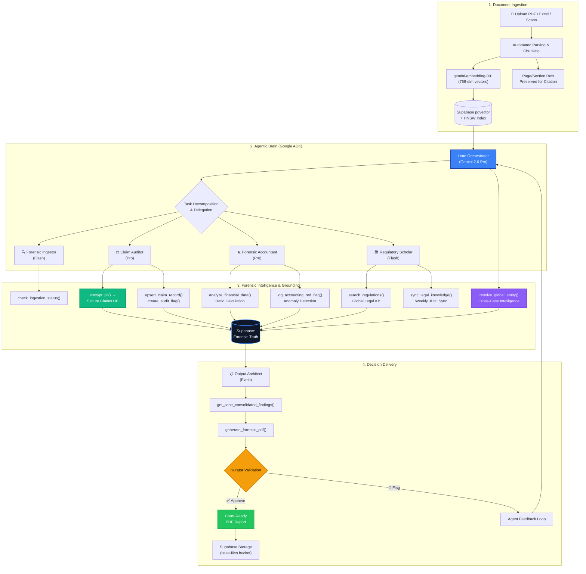
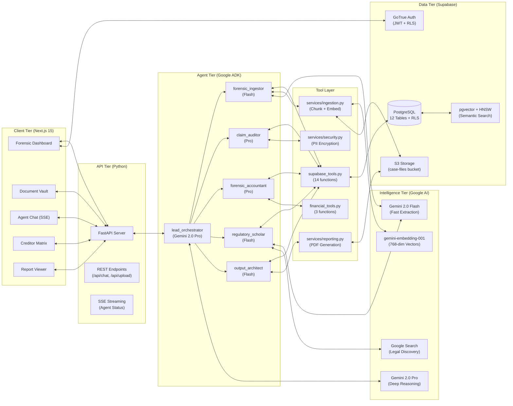
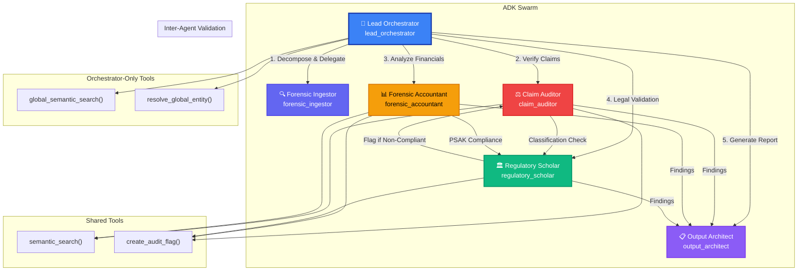
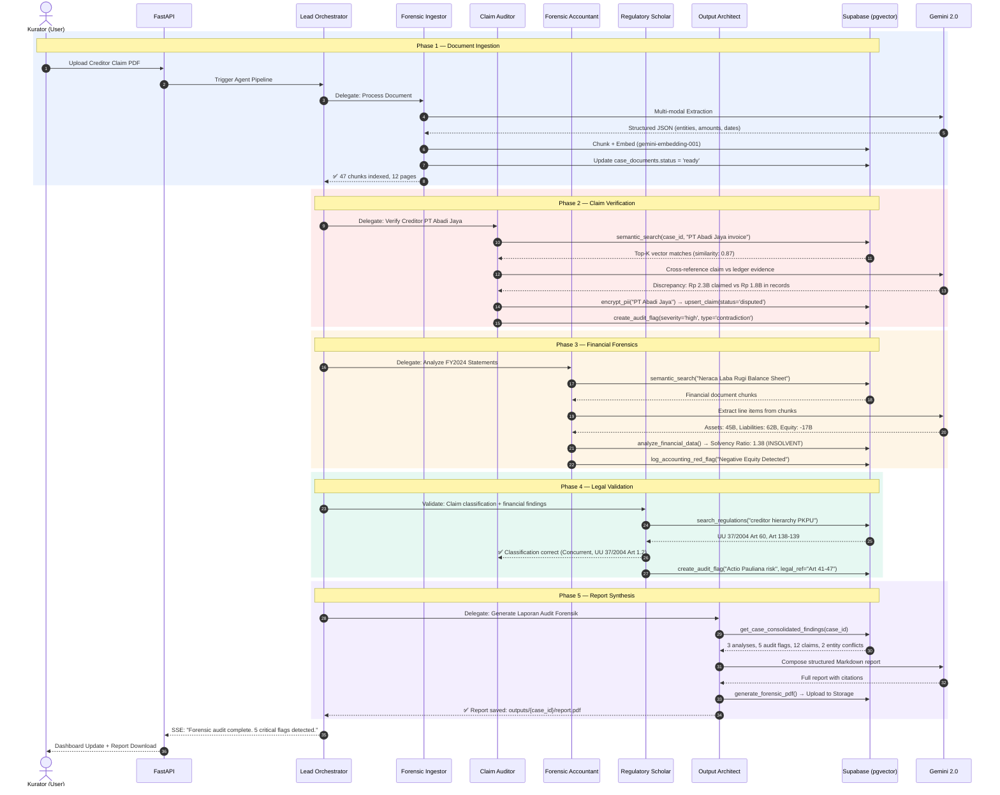
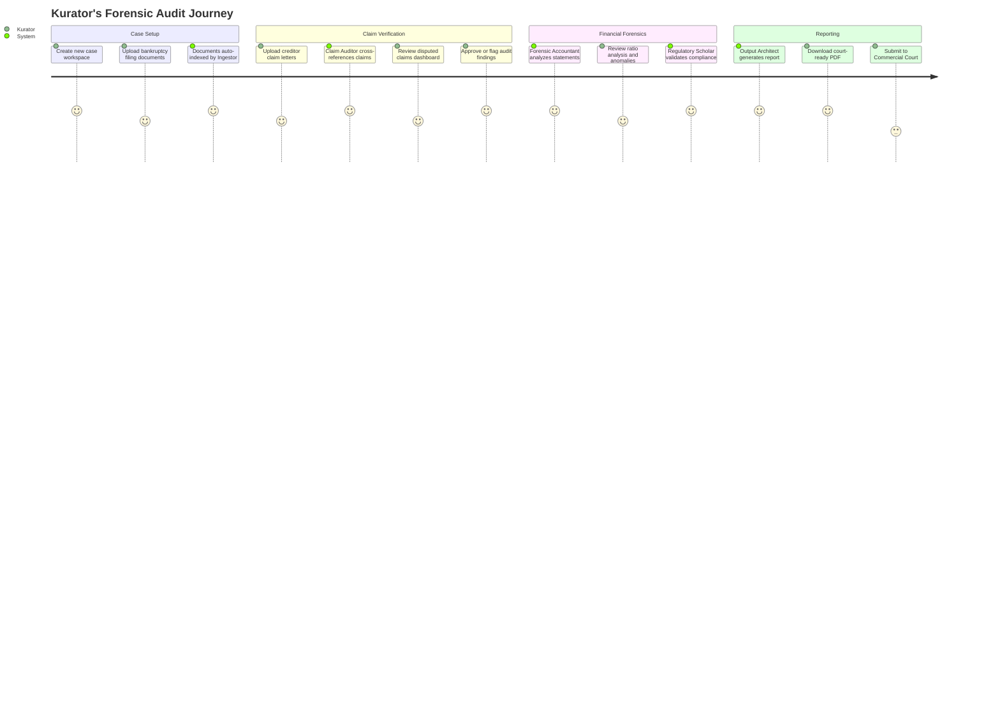
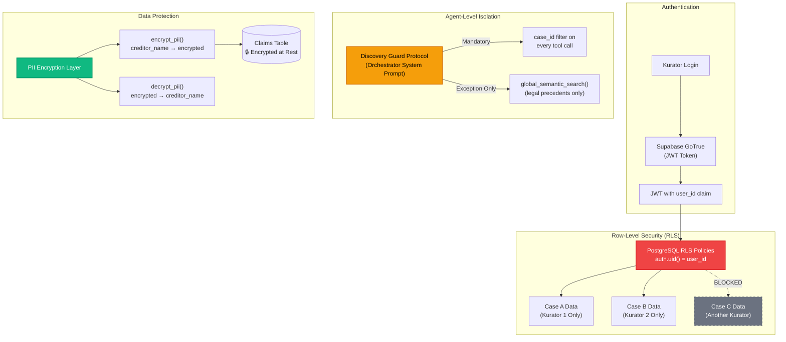

# KuratorMind AI: Technical Diagrams V2

> **V2 Changelog:** All diagrams verified against actual implementation in `apps/agents/`, `supabase/migrations/`, and `tools/`. Corrected model names, added missing agents, expanded ER to cover all 12 tables, and added 3 new diagrams (Agent Coordination, User Journey, Security Architecture).

**Stack:** Google ADK (Python) · Gemini 2.0 Pro/Flash · gemini-embedding-001 · Supabase (PostgreSQL + pgvector) · Next.js 15

---

### **1. Process Flow: The Forensic Data Loop (Complete)**

This diagram shows the end-to-end transformation of raw documents into court-ready forensic reports, including PII encryption, financial analysis, entity resolution, and the human-in-the-loop validation.

---

### **2. System Architecture: Full-Stack Agentic Workspace**

A component-level view matching the actual directory structure and package dependencies.

---

### **3. Agent Coordination: Multi-Agent Swarm Topology**

How the 5 agents communicate and validate each other's work.

---

### **4. Sequence Diagram: Full Forensic Audit Cycle**

How a single document flows through all 5 agents in a complete audit cycle.

---

### **5. Data Entity Model: Complete Schema (12 Tables)**

Based on actual `supabase/migrations/` — all tables with relationships and key attributes.

```mermaid
erDiagram
    CASES ||--o{ CASE_DOCUMENTS : contains
    CASES ||--o{ CLAIMS : audited_in
    CASES ||--o{ CHAT_SESSIONS : workspace_for
    CASES ||--o{ AUDIT_FLAGS : flagged_in
    CASES ||--o{ AGENT_TASKS : orchestrated_in
    CASES ||--o{ GENERATED_OUTPUTS : produces
    CASES ||--o{ FINANCIAL_ANALYSES : analyzed_in

    CASE_DOCUMENTS ||--o{ DOCUMENT_CHUNKS : vector_source

    CLAIMS ||--o{ AUDIT_FLAGS : has_issue

    CHAT_SESSIONS ||--o{ CHAT_MESSAGES : contains

    AGENT_TASKS ||--o{ AGENT_TASKS : parent_child

    GLOBAL_ENTITIES ||--o{ ENTITY_OCCURRENCES : appears_in
    CASES ||--o{ ENTITY_OCCURRENCES : linked_to

    CASES {
        uuid id PK
        uuid user_id FK "→ auth.users"
        text name
        text debtor_entity
        text case_number
        text stage "pkpu_temp|pkpu_permanent|bankrupt|liquidation|closed"
        text status "active|archived|closed"
        jsonb metadata "last_sync timestamp"
    }

    CASE_DOCUMENTS {
        uuid id PK
        uuid case_id FK
        text file_name
        text file_type
        text file_path "→ Supabase Storage"
        text status "pending|processing|ready|error"
        integer page_count
        text summary
    }

    DOCUMENT_CHUNKS {
        uuid id PK
        uuid document_id FK
        uuid case_id FK
        text content
        integer chunk_index
        integer page_number
        text section_title
        vector embedding "pgvector(768) + HNSW"
    }

    CLAIMS {
        uuid id PK
        uuid case_id FK
        text creditor_name "🔒 encrypt_pii()"
        text_array creditor_aliases "🔒 encrypted"
        numeric claim_amount
        text claim_type "preferential|secured|concurrent"
        text status "pending|verified|disputed|rejected"
        numeric confidence_score
        text legal_basis
    }

    AUDIT_FLAGS {
        uuid id PK
        uuid case_id FK
        uuid claim_id FK
        text severity "critical|high|medium|low"
        text flag_type "contradiction|actio_pauliana|entity_duplicate|non_compliance|anomaly|inflated_claim"
        text title
        text description
        jsonb evidence
        text legal_reference
        boolean resolved
    }

    CHAT_SESSIONS {
        uuid id PK
        uuid case_id FK
        uuid user_id FK
        text title
    }

    CHAT_MESSAGES {
        uuid id PK
        uuid session_id FK
        text role "user|assistant|system"
        text content
        jsonb citations
        text agent_name
    }

    AGENT_TASKS {
        uuid id PK
        uuid case_id FK
        uuid parent_task_id FK "self-referencing"
        text agent_name
        text task_type
        text status "submitted|working|input_required|completed|failed"
        jsonb input_data
        jsonb output_data
    }

    GENERATED_OUTPUTS {
        uuid id PK
        uuid case_id FK
        text output_type "presentation|spreadsheet|legal_summary"
        text title
        text file_path "→ Storage"
        jsonb content
        jsonb citations
    }

    FINANCIAL_ANALYSES {
        uuid id PK
        uuid case_id FK
        uuid document_id FK
        text report_type "balance_sheet|income_statement|cash_flow"
        text period
        jsonb ratios "current_ratio, solvency, etc"
        jsonb psak_compliance
        jsonb anomalies
    }

    GLOBAL_ENTITIES {
        uuid id PK
        text name
        text entity_type "creditor|debtor|director|counsel"
        numeric risk_score
    }

    ENTITY_OCCURRENCES {
        uuid id PK
        uuid entity_id FK
        uuid case_id FK
        text source_type "claim|chunk"
        uuid source_id
    }
```

---

### **6. User Journey: Kurator's Forensic Workflow**

How a Kurator interacts with the system from case creation to court submission.

---

### **7. Security Architecture: Multi-Tenant Isolation**

How KuratorMind prevents cross-case data contamination.

---

### **Technical Rationale (for Hackathon Judges)**

| Dimension | Implementation Detail | Why It Matters |
|---|---|---|
| **Vector Performance** | pgvector with **HNSW indexing** (`vector_cosine_ops`), `match_document_chunks` RPC with threshold filtering | Sub-second retrieval even at 100K+ chunks. HNSW chosen for recall vs. IVFFlat for this scale |
| **Orchestration Pattern** | ADK `Agent` class with `sub_agents` list, each with dedicated `tools` and `model` assignment | Non-deterministic "Plan-Act-Observe" loop allows the Auditor to self-correct before flagging humans |
| **Model Strategy** | Pro (2.0) for deep reasoning (Orchestrator, Auditor, Accountant); Flash (2.0) for throughput (Ingestor, Scholar, Architect) | Cost-optimized: Pro only where legal/financial accuracy demands it, Flash for volume tasks |
| **Data Integrity** | Full RLS on all 10+ tables. PII encryption on creditor names. `case_id` boundary enforcement in agent instructions | Zero cross-tenant data leakage possible at both DB and agent prompt layers |
| **Entity Resolution** | `resolve_global_entity()` with ilike fuzzy matching + exact match fallback. Returns `has_conflict` boolean | Detects serial bankruptors and conflicts of interest — a forensic capability unique to KuratorMind |
| **Legal Currency** | `sync_legal_knowledge()` scrapes OJK/Kemenkeu/BPHN weekly using Gemini + Google Search grounding | Regulations are always current, not stale training data. Embeds discoveries into global case |
| **Report Safety** | `generate_and_save_report()` truncates content >500K chars before PDF generation | Prevents OOM crashes on extremely large forensic audits |

---

### **V1 vs V2 Diagram Comparison**

| Diagram | V1 | V2 |
|---|---|---|
| **Process Flow** | 3 agents, no PII or entity resolution | 5 agents, PII encryption, entity resolution, financial analysis pipeline |
| **Architecture** | Missing FastAPI, PII layer, 3 components | Full 6-layer architecture with tool layer and intelligence tier |
| **Sequence** | 1 audit path (claim only) | Complete 5-phase audit cycle covering all agents |
| **ER Diagram** | 4 tables | 12 tables matching real `supabase/migrations/` |
| **Agent Coordination** | ❌ Not present | ✅ New: Shows inter-agent validation and tool sharing |
| **User Journey** | ❌ Not present | ✅ New: Kurator workflow from case creation to court submission |
| **Security Architecture** | ❌ Not present | ✅ New: RLS, Discovery Guard, PII encryption layers |
